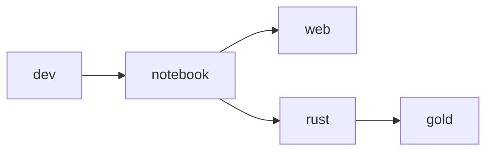

Getting Started
===============
- Read this guide (including the [Code of Conduct](CODE_OF_CONDUCT.md))
- Check out our [Trello page](https://trello.com/b/WEMB9CEL/gold) to see what features and fixes are planned.
- Fork this repository and clone your fork locally
- [Setup your environment](#project-setup) to use development tasks (test, lint, etc...)
- Adhere to the [project standards](#project-standards)
- Write some code and stuff...
- Push your changes and create a pull request

Code of Conduct
---------------
> Please read and adhere to the [code of conduct](CODE_OF_CONDUCT.md)

Introduction
------------
> First off, thank you for considering contributing to `Gold`!

If you would like to make a feature request or enhancement suggestion, please open an issue.

If you would like to generously provide a pull request to correct a verified issue, please adhere to this project's [standards](#project-standards). Before making a pull request for a desired feature, please socialize the concept by opening an issue first.

Project Architecture
--------------------
> 🚧 UNDER CONSTRUCTION

### Image Design
> [!NOTE]
> Images are built using GitHub Actions and deployed to the Github Container Registry, `ghcr.io`, under the username, `jhwohlgemuth`

The following images are available:
- `ghcr.io/jhwohlgemuth/dev`: Core image with all necessary system dependencies (intended for **dev**elopment)
- `ghcr.io/jhwohlgemuth/notebook`: Images with [Jupyter notebook](https://github.com/jupyter/notebook) server and [code-server](https://github.com/coder/code-server) services managed by [s6-overlay](https://github.com/just-containers/s6-overlay)
- `ghcr.io/jhwohlgemuth/web`: Web development environment and [Verdaccio](https://verdaccio.org/) proxy npm registry [1](#1)
- `ghcr.io/jhwohlgemuth/rust`: Environment ready for writing Rust code and working with WebAssembly
- `ghcr.io/jhwohlgemuth/gold`: Proof assistants, provers, and other tools for software correctness

The images are build according to the following dependency graph:

Project Setup
-------------
> 🚧 UNDER CONSTRUCTION
### Requirements
- [Docker](https://www.docker.com/get-started/) and/or [Podman](https://podman.io/get-started) - d'uh
- [dos2unix](https://dos2unix.sourceforge.io/#DOS2UNIX) - format scripts for execution within a Unix environment
- [hadolint](https://github.com/hadolint/hadolint) - analyze Dockerfiles
- [yamllint](https://github.com/adrienverge/yamllint) - analyze YAML files
- [checkov](https://github.com/bridgecrewio/checkov) - provides more checks for Dockerfiles and YAML files
- [shfmt](https://github.com/patrickvane/shfmt) - format shell scripts
- [shellcheck](https://github.com/koalaman/shellcheck) - analyze shell scripts

Project Standards
-----------------
> 🚧 UNDER CONSTRUCTION

- Code changes should never [2](#2) introduce issues detected by `make lint` or `make check`
- When in doubt, write code that is consistent with preponderance of existing codebase. Let's call this the "***priority of pre-existing preponderance (P3) rule***".
- Exceptions to any of these standards should be supported by strong reasoning and sufficient effort

-------------

**Footnotes**
-------------

[1]
---
> Default Verdaccio proxy npm registry port is `4873` ([documentation](https://verdaccio.org/docs/configuration#listen-port))

[2]
---
> "never" is strong language...sometimes you might need to accept an issue or skip/ignore it. But, you should always have a good reason for doing so and such a scenario should be few and far in-between.
